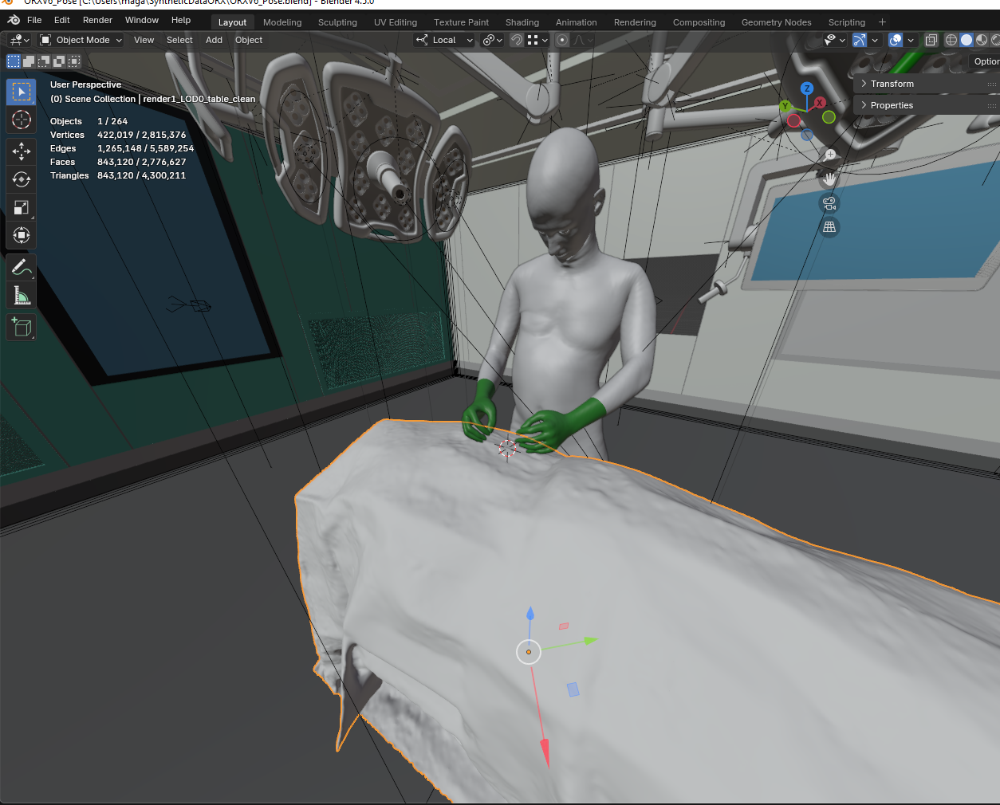

# Stickman to smplx

This repository uses the conventional 3d points of a person and creates the smplx mesh out of them. Using the mesh, it can then be imported in Blender.
This repo uses python 3.11.9
<p align="center">
  
</p>

**Figure 1.** Stickman 3D visualization.

 
## Setup Instructions

### Setup Environment
Create a new Python virtual environment (recommended to keep dependencies isolated) and download requirements.

**Windows (PowerShell or CMD):**
  ```
  python -m venv venv
  .\venv\Scripts\activate
  pip install --upgrade pip
  pip install -r requirements.txt
```

Download the smplx models from the [project website](https://smpl-x.is.tue.mpg.de/) and put the models folder in the same directory.

## Generate SMPL-X Joint Points

This script maps your custom 3D body and hand keypoints into the **SMPL-X joint format**.

### 1. Map stickman data to SMPL-X
Run the mapping script with your input body and hand joint files:

```
python mapping_stickman_to_smplx.py --body BODY_FILE --hand HAND_FILE [--output OUTPUT_FILE]
```

Now visualize the data using the **`visualize_joints.py`** file. 

```
python visualize_joints.py --frame FRAME_NUMBER
```

- Make sure that the body stands along the positive Y-axis. 
- The pelvis should be close to the origin (0,0,0). 
- The Person should be facing the positive Z-direction 
- The left shoulder should be in the positive X-direction and right shoulder in negative X-direction (exactly like the right person in [Figure 1](#figure-1-stickman-3d-visualization).)

If this is not the case, change the **rot_mat** inside of **mapping_stickman_to_smplx.py** to adjust this and try again. Otherwise the SMPL-X mesh will not look good.

### 2. Get the SMPL-X Mesh
Run the script to approximate the best fitting smpl-x mesh to the given joints:

```
python get_mesh_from_3dpoints.py
```
This outputs 4 files:
- **`all_meshes.npy`** 
- **`all_joints.npy`** 
- **`smoothed_all_meshes.npy`** (applied low-pass filter)
- **`smoothed_all_joints.npy`**  (applied low-pass filter)

I recomend using the smoothed files for renders.

### 3. Visualize the mesh
After generating the meshes and joints, you can visualize any frame with:

```
python visualize_smplx.py --frame FRAME_NUMBER
```
This will open an interactive 3D plot (saved as 3d_smplx_plot.html) showing the SMPL-X body mesh along with joint markers and axes.


# Blender Implementation

### Setup
1. Download the blender file  at: W:\Forschung-CARD\Mitarbeiter\Zivildiener\DTORX. Place the output files `smoothed_all_meshes.npy` and `smoothed_all_joints.npy` inside a dataset folder inside of an `output_3d/` folder next to the **ORXV8_Pose.blend** file. 
The file structure should be as follows:
```
parent/
├── table+model/
├── ORXV8_Pose.blend
└── output_3d/
    ├── smplx_faces.npy (copy from this repo)
    └── dataset/
        ├── smoothed_all_meshes.npy
        ├── smoothed_all_joints.npy
        ├── body_poses_3d.npz
        └── hand_poses_3d.npz
```
2. Open the Blender project.  
3. Switch to the **Scripting** tab and select the **`smplx_mesh_hands_body.py`** or the **`smplx_mesh_hands.py`** file.
4. Adjust the dataset folder name accordingly in line 7 and run the script.  

### File Overview
These files are all saved in the scripting tab of the blender project.

- **`smplx_mesh_body.py`**  
  Displays the SMPL-X body for all frames.  

- **`smplx_mesh_hands.py`**  
  Displays only the hands for all frames.  

- **`smplx_mesh_body_and_hands.py`**  
  Displays the SMPL-X body for all frames and highlights the hands in color.  

- **`animated_torso.py`**  
  Displays the stickman body for all frames (from torso upwards).

- **`animated_hands_only.py`**  
Displays the stickman hands for all frames.

- **`animated_body.py`**  
Displays the stickman body for all frames.

- **`Place Camera v2.py`**  
Place the real-life cameras in the blender ORX using the aligned_poses.json file and the intrinsic json file of the camera you want to place.

- **`render.py`**  
Renders the scene using the prefered cameras.

### Preview
To preview the animation in Blender:
1. Click the **Python Console** icon (left-hand side).  
2. Switch to the **Timeline** view.  
3. Press **Play**.  

### Rendering
1. Open the **`render.py`** script inside of the blender project.
2. Choose if you want good renderings or fast renderings in lines 55/56
3. Choose the cameras in line 64
4. Choose your dataset in line 67
5. Choose if you want to Render only one specific frame or all frames in line 73


<p align="center">
  
</p>